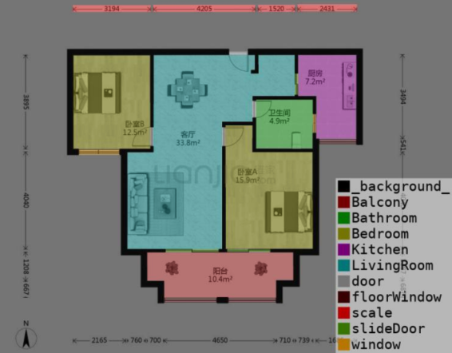
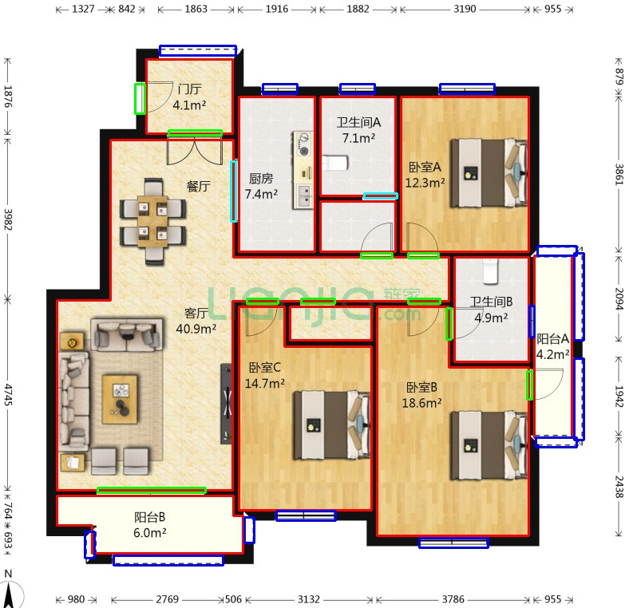
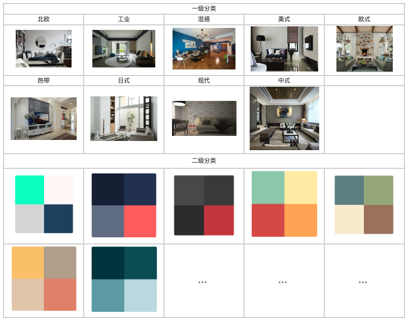

This project is processing during I worked at B&Q company.

At B&Q, where I previously worked as an Applied Scientist, I built a recommendation system that generated architectural layout suggestions based on user preferences, 
transforming floor plans into 2D matrices and enhancing customer experiences through similarity detection algorithms. 
This experience reinforced my capabilities in ML model development and demonstrated my capacity for impactful AI-driven solutions, 
which I am eager to extend into creating meaningful gameplay experiences.

The first step is to detect the space, scale marks and wall/door/window in floorplan.

Then for each space based on the existing category, we match the top 5 case for consumers.

